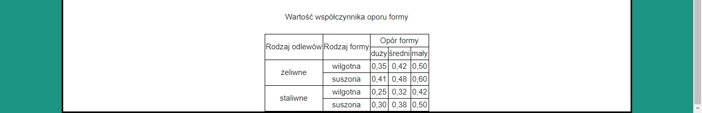

# Lab 1
## Praca z systemem kontroli wersji. Podstawy WWW.
### Cel - stworzyć prostą stronę WWW, nie wymagającą użycia serwera webowego,strona powinna zawierać linki do trzech podstron, które należy utworzyć:
Strona z listem  
Odpowiednio sformatowany tekst, przypominający list, po prawej data oraz miejscowość, po lewej nadawca listu, następnie po prawej jest wpisany odbiorca oraz od lewej treśc listu i po prawej podpis nadawcy.

  
Strona z podręcznika  
Zawiera wzór na sumę powierzchni przekrojów wlewów doprowadzających, jak obraz schematy położenia odlewu w formie odlewniczej oraz tabelę wartości współczynnika oporu formy.

  
Strona z formularzem  
Zawiera pola tekstowe, checkbox i przycisk SUBMIT
  
Na stronie startowej jest umieszczona informacja o autorze oraz o użytych technologiach.
