# Lab 3
## Obsługa zdarzeń
### Zadania
Zadanie 1  
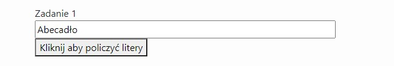
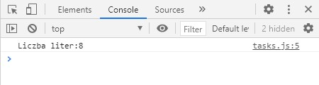
Zadanie 2  
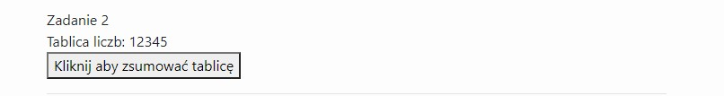
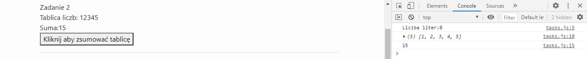
Zadanie 3  
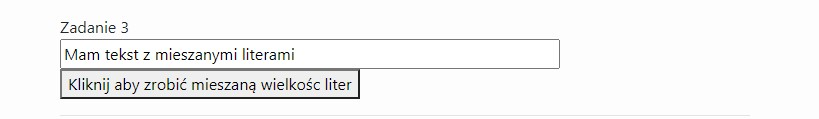
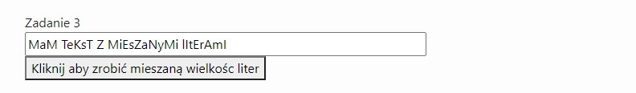
Zadanie 4  
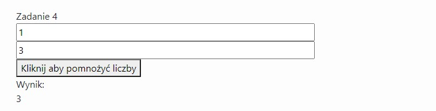
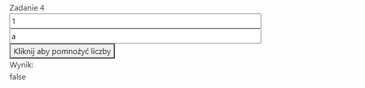
Zadanie 5  
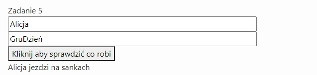
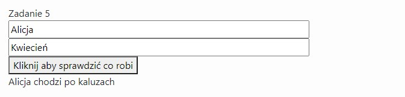
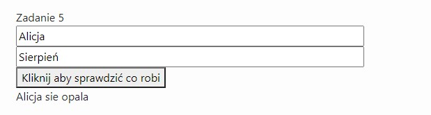
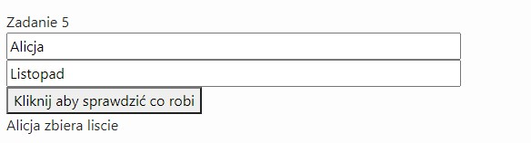
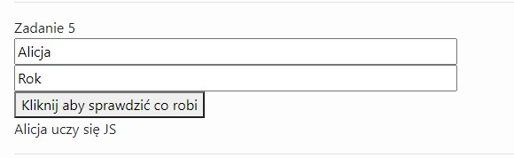
Zadanie 6  
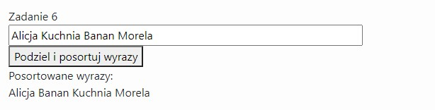
Zadanie 7  
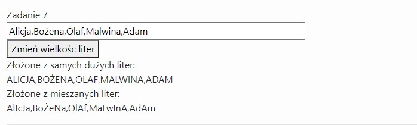
Zadanie 8  
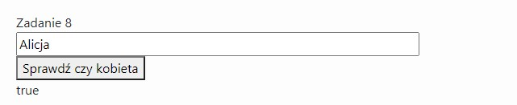
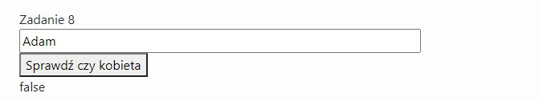
Zadanie 9  
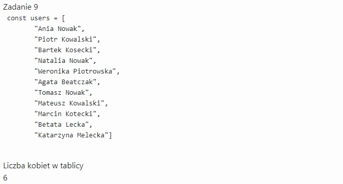
### Zdarzenia
Zdarzenie 1  

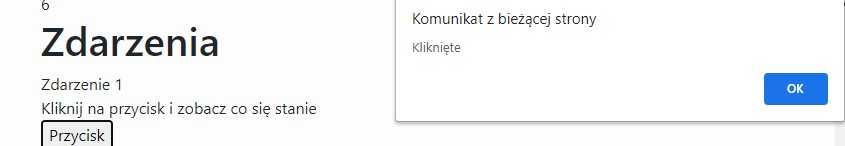
Zdarzenie 2  
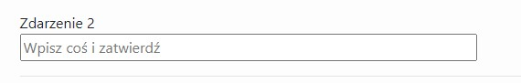
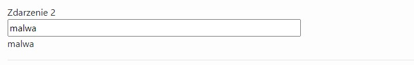
Zdarzenie 3  
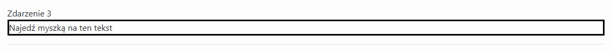
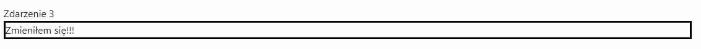
Zdarzenie 4  
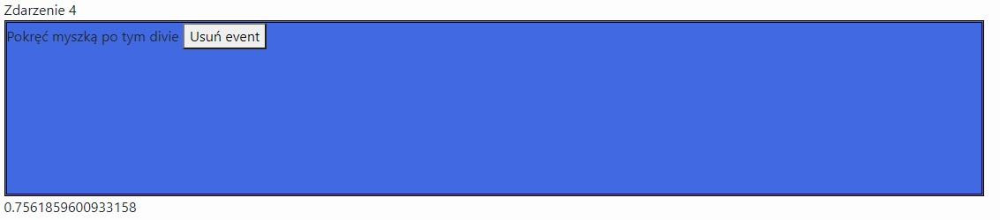
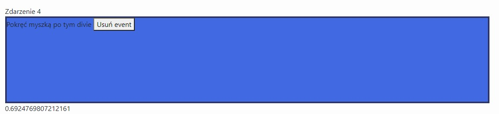
Zdarzenie 5  
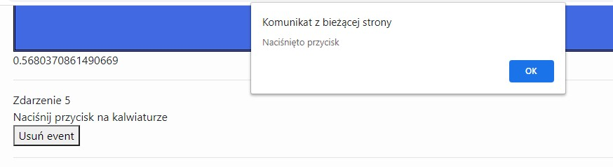
Zdarzenie 6  

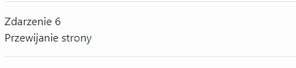
Zdarzenie 7  
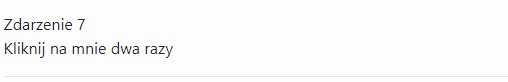

Zdarzenie 8 i 9  
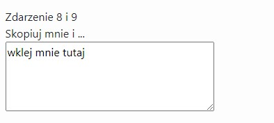
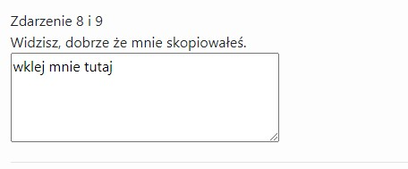
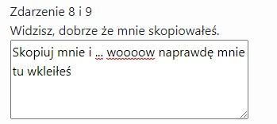
Zdarzenie 10  
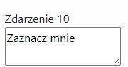
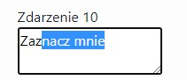
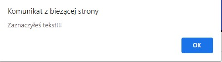