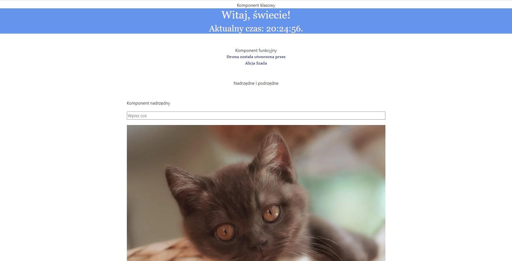
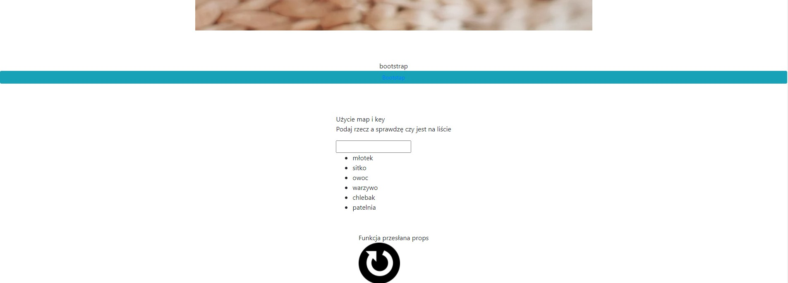
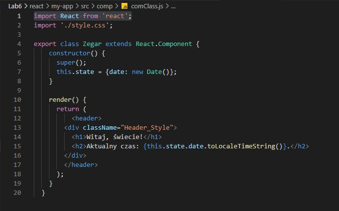
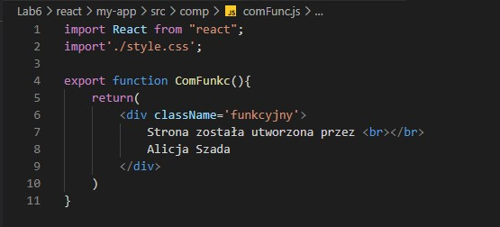
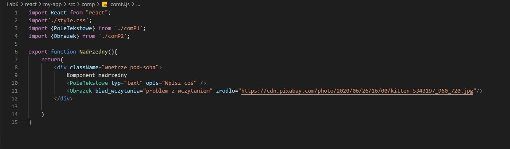
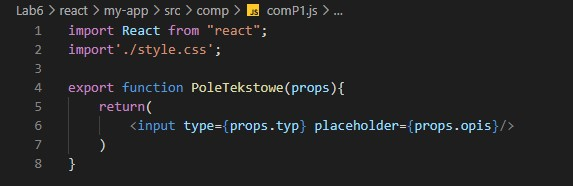
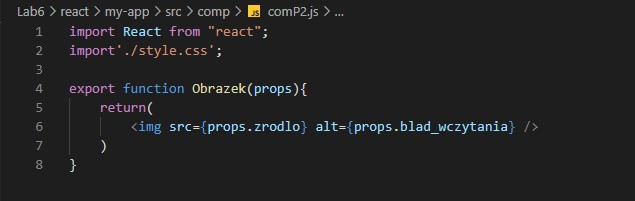
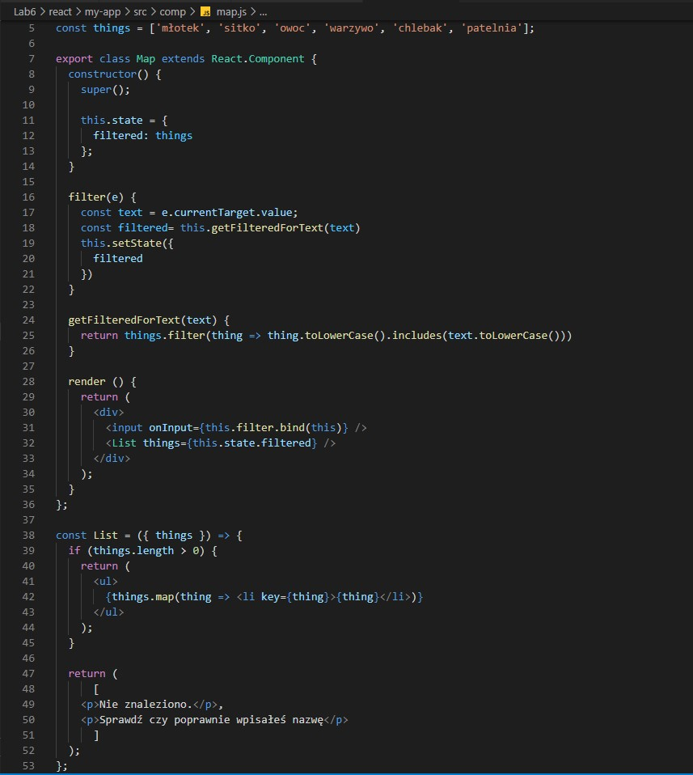
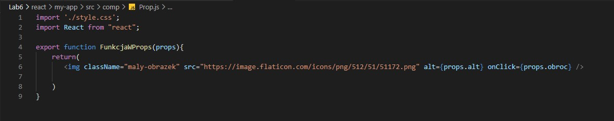

# Lab 6
## React - aplikacja 1
### Wygląd
  
  
### Kod
Komponent klasowy  
  
Komponent funkcyjny  
  
Komponent nadrzędny  
  
Komponent podrzędny pierwszy  
  
Komponent podrzędny drugi  
  
Zastosowanie funkcji map()  
  
Wysyłanie funkcji za pomocą props

W folderze **Pliki z kodem** są tylko pliki które zostały zmienione bądź dodane do aplikacji podstawowej.