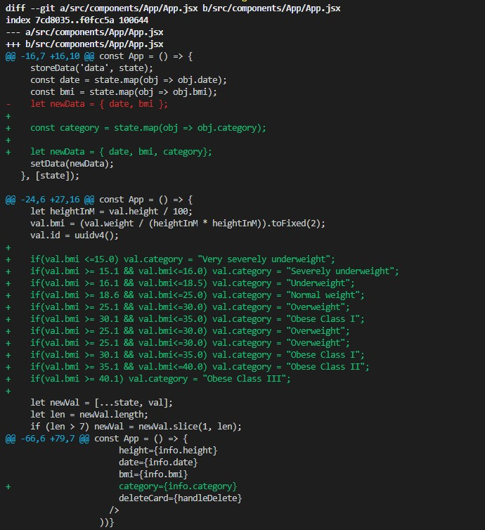

# Lab 8
## React - aplikacja nr 2 + analiza kodu źródłowego + git difftool
W folderze **Pliki z kodem** są wszystkie pliki komponentowe łącznie z tymi, w których zostały wprowadzone modyfikacje, z aplikacji ze strony https://github.com/GermaVinsmoke/bmi-calculator.  
__Opis modułów:__
* cypress - framework używany przedewszystkim do testów end to end.
* uuid    - tworzenie identyfikatorów UUID.
* materialize-css - nowoczesny responsywny framework CSS oparty na Material Design Google.
* react-chartjs-2 - "opakowanie" React dla Chart.js 2. Otwarte dla PR i wkładów.
* prop-types - sprawdzanie typów w czasie wykonywania dla właściwości React i podobnych obiektów.

__Kod i komponenty:__
* Komponent App - główna aplikacja. Zawiera elementy strony głównej. Posiada metody usuwające wpisy, dodające nowe wpisy, pobiera od użytkownika wagę oraz wzrost i na podstawie tych danych oblicza bmi.  
Pobiera następujące komponenty: BmiForm, Info, Bar, localstorage.
* Komponent Bar - odpowiedzialny jest za wykres.
* Komponent BmiForm - odpowiedzialny jest za tworzenie formularza pobierania danych od użytkownika
* Komponent Info - wyświetla dane z konkretnego pomiaru (widoczne w dolnej części strony)
* Komponent localStorage - odpowiedzialny za przechowywanie danych w local Storage

__Modyfikacja__: dodanie kommunikatu o katgorii BMI  

__Widok z modyfikacją__  
  
__Pliki w któych zostały wprowadzone modyfikacje__  
  
__Widok modyfikacji w difftool wbudowanym w Visual Studio Code__  
App.jsx  
  
  
Info.jsx  
  
__Widok wprowadzonych zmian w terminalu wypisany za pomocą "git diff"__  
App,jsx  
  
Info.jsx
  