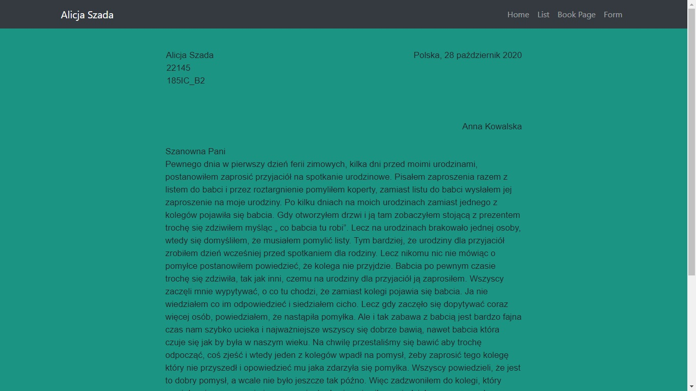
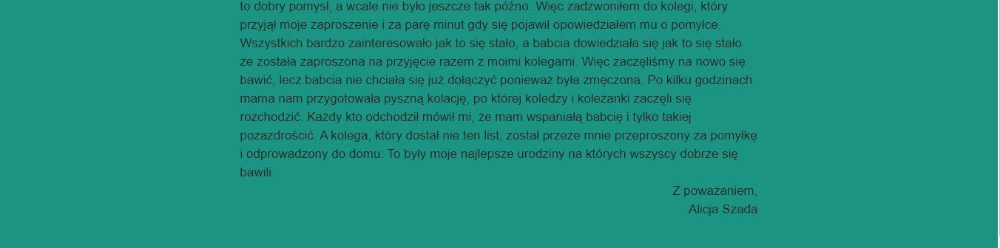

##Lab 1
#Praca z systemem kontroli wersji. Podstawy WWW.
cel - stworzyć prostą stronę WWW, nie wymagającą użycia serwera webowego,
strona powinna zawierać linki do trzech podstron, które należy utworzyć:
strona z listem (odpowiednio sformatowany tekst, przypominający list),

strona z podręcznika, np. do informatyki (rysunki, tabele, wzory itp.),

strona z formularzem (inputy, pola tekstowe, checkboxy itp.), na początku bez walidacji wartości pól.

na stronie startowej należy umieścić informację o autorze oraz opcjonalnie np. logo, informacje o użytych technologiach itp.

należy utworzyć plik README.md, który będzie zawierał opis repozytorium,
zrzut każdej z czterech utworzonych stron należy umieścić w pliku README.md jak obrazek i krótko opisać; jak to zrobić opisane jest w nw. linku o Markdown w sekcji ‘Images’.
