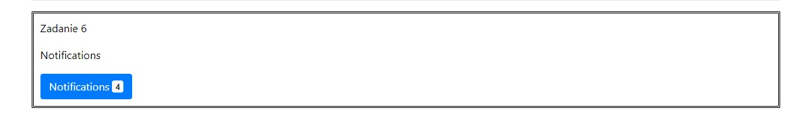
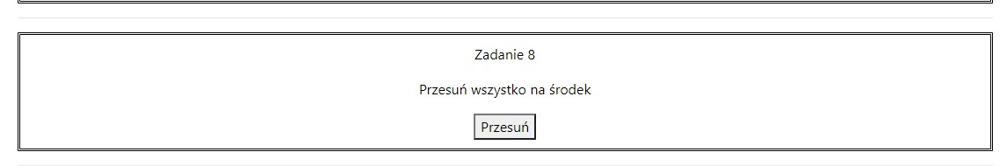

# Lab 1
## Praca z systemem kontroli wersji. Podstawy WWW.
### Cel - stworzyć prostą stronę WWW, nie wymagającą użycia serwera webowego,strona powinna zawierać linki do trzech podstron, które należy utworzyć:
Strona z listem  
Odpowiednio sformatowany tekst, przypominający list, po prawej data oraz miejscowość, po lewej nadawca listu, następnie po prawej jest wpisany odbiorca oraz od lewej treśc listu i po prawej podpis nadawcy.

  
Strona z podręcznika  
Zawiera wzór na sumę powierzchni przekrojów wlewów doprowadzających, jak obraz schematy położenia odlewu w formie odlewniczej oraz tabelę wartości współczynnika oporu formy.

  
Strona z formularzem  
Zawiera pola tekstowe, checkbox i przycisk SUBMIT
  
Na stronie startowej jest umieszczona informacja o autorze oraz o użytych technologiach.
  
# Lab 2
## Praca z elementami DOM + ćwiczzenia
Wprowadzone modyfikacje
Zadanie1

Zadanie2

Zadanie 3

Zadanie 4

Zadanie 5

Zadanie 6

Zadanie 7

Zadanie 8

Zadanie 9

Zadanie 10

Zadanie 11

Zadanie 12

Zadanie 13

Zadanie 14

Zadanie 15

Zadanie 16

Zadanie 17

Zadanie 18

Zadanie 19

Zadanie 20

